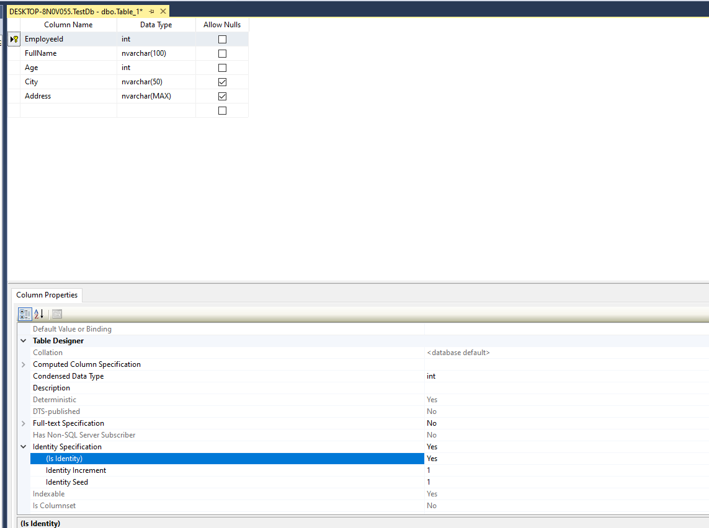

# Persisting Data

Data being transferred from Client to Server via API must be stored somewhere parmanently since the HTTP API's are stateless, the server doesn't keep the connection open, once the request is served with response the server will continue responding to other client requests and will not retain any information about the previous requests or client.

So the data must be stored in some storage system, it can be a file system of the server or a **Database**.

Database are designed to persist data and provide an easy way of interacting with it. There are two types of Database system mainly, **Relational Database** and **No-SQL database**.

As part of this course we will be using Relational Database. There are many Relational Database providers like Microsoft SQL Server, Oracle, My SQL etc. 

Microsoft SQL Server is widely used with the combination of applications built using Microsoft technologies.

<br>

## Microsoft SQL Server (MS SQL)

Microsoft SQL Server is a relational database management system developed by Microsoft. As a database server, it is a software product with the primary function of storing and retrieving data as requested by other software applications—which may run either on the same computer or on another computer across a network.

Microsoft markets at least a dozen different editions of Microsoft SQL Server, aimed at different audiences and for workloads ranging from small single-machine applications to large Internet-facing applications with many concurrent users.

You can download SQL Server free developer edition here: https://www.microsoft.com/en-in/sql-server/sql-server-downloads

Once SQL Server is installed completely, you can now start creating a new Database and create some tables.



Create a table called Employee and provide some column names of your choice, but make one column as `Primary key` and enable `Identity` for the same, so it takes care of making that column unique for every record.

Once done you can try different `SQL` statements like creating records, writing select statements or deleting the records etc.

Inserting:

```sql
INSERT [dbo].[employees] ([FullName], [Age], [City], [Address]) VALUES (N'Joe Nelco', 23, N'Bangalore', NULL)

INSERT [dbo].[employees] ([FullName], [Age], [City], [Address]) VALUES (N'Pal Rick', 26, N'Pune', NULL)

```

Selecting:

```sql
  SELECT [EmployeeId],
        [FullName],
        [Age],
        [City],
        [Address]
  FROM [TestDb].[dbo].[employees]
  WHERE Age > 25
```

Deleting:

```sql
DELETE FROM [TestDb].[dbo].[employees] WHERE [EmployeeId] = 1
```

This way we can do different operation of data using SQL Server Database and we will use the same for upcoming concepts of storing data via Web API.

## :white_check_mark: Tasks
:white_check_mark: Create new Database called `ToyStore`.

:white_check_mark: Create a table called `Toys` with columns: `Id (int)(identity)(pk)`, `Name (nvarchar(30))`, `Description(nvarchar(500))`, `Price (float)`, `Quantity (int)`.

:white_check_mark: Write different queries to perform **CRUD** operation.