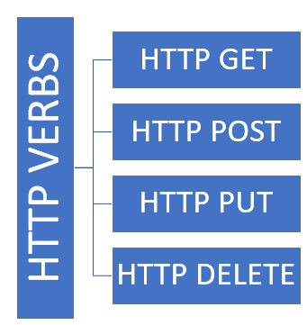

# ASP.NET Core Web API

1. [Introduction](#introduction)
2. [Creating a Web API application](#create-an-aspnet-core-web-api)
3. [Testing with Postman](#test-with-postman)
4. [Persisting data](database.md#persisting-data)
   * [Microsoft SQL Server (MS SQL)](database.md#microsoft-sql-server-ms-sql)
5. [Tour of Heroes - Complete Web API](tourofheroes/index.md)
   * [Database design](tourofheroes/index.md#database-design)
   * [Entity Framework](tourofheroes/index.md#entity-framework)
   * [Data access methods](tourofheroes/index.md#defining-data-access-methods)
   * [Exposing API's](tourofheroes/api.md)
   * [Adding Authentication](tourofheroes/api.md#adding-authentication)

## Introduction

API stands for Application Programming Interface. It is an intermediate software agent that allows two or more applications to interact with each other.

Web API is an application programming interface for a web application or web server. It uses HTTP protocol to communicate between clients and websites to have data access. 

### Why is Web API required?
The user wants to access the application from different devices like mobile, browser, Google devices, etc. In this case, Web API can be useful. 

Different devices request to Web API and Web API will respond in JSON format. Most of the devices are able to understand JSON output. 

ASP.NET Web API is a ready made framework to build a standard HTTP Web API's for different purposes.


## ASP.NET Web API Characteristics
* ASP.NET Web API is an ideal platform for building RESTful services.
* ASP.NET Web API is built on top of ASP.NET and supports ASP.NET request/response pipeline
* ASP.NET Web API maps HTTP verbs to method names.
* ASP.NET Web API supports different formats of response data. Built-in support for JSON, XML, BSON format.
* ASP.NET Web API can be hosted in IIS, Self-hosted or other web server that supports .NET 4.0+.

<hr>

# Create an ASP.NET Core Web API

> Prerequisite: Install Visual Studio version 2019 or more.

1. Create a new Project
    <br>

    

    Select ASP.NET Core Web application

2. Provide name, location and solution name as given

    

3. Select the template as below and click create.

    


4. Run the application

    


5. The application should now open in the default browser.

    

<br>


## Controllers:

Controllers takes main part by defining different API methods in it, and it is responsible to handle incoming HTTP request and execute the corresponding API method defined in it and return the response back to the user / client.

Web API controller is a `class` which can be created under the **Controllers** folder or any other folder under your project's root folder. The name of a `controller` `class` must end with "*Controller*" and it must be derived from `Microsoft.AspNetCore.Mvc.ControllerBase` `class`. All the public methods of the controller are called **action methods**.

### Create a new controller:

1. Right click on `Controllers` folder and select `Add` -> `Controller` and select `API Controller - Empty`

2. Provide a name to the controller example `HomeController` and press add.

```C#
using System;
using System.Collections.Generic;
using System.Linq;
using System.Threading.Tasks;
using Microsoft.AspNetCore.Http;
using Microsoft.AspNetCore.Mvc;

namespace TourOfHeroes.Controllers
{
    [Route("api/[controller]")]
    [ApiController]
    public class HomeController : ControllerBase
    {
    }
}
```

You have created a new controller but it is empty, meaning a new route is defined like https://localhost:44367/**home** but it doesn't have any `HttpMethod` defined right now.

### What is `HttpMethod` ?

Http methods are **actions** which does a specific operation on the *resources*. All operations on the resource are categorized and associated with corresponding http methods, like Creating a resource or Updating a resource. 

A *resource* is an entity on which the operation is being applied, example if an API written to create an Employee record in the database, then the resource is `Employee` and the operation is `Create`. 

All the `CRUD` (Create, Read, Update and Delete) operations are mainly identified with the `HttpMethod` like `POST`, `GET`, `PUT` and `DELETE` respectively. They are also called as `HTTP Verbs`.



<br>

1. GET: The GET method is used to retrieve information from the given server using a given URI. Requests using GET should only retrieve data and should have no other effect on the data.

3. POST: A POST request is used to send data to the server, for example, customer information, file upload, etc. using HTML forms.

4. PUT: Replaces all current representations of the target resource with the uploaded content.

5. DELETE: Removes all current representations of the target resource given by a URI.

<br>

### Defining Http methods in the controller:

ASP.NET makes it easy to define HTTP methods for your API's. Defining a new `public method` in the `controller` will be treated as Http method. They are called as **action methods** in ASP.NET world. 

Adding a new action methods in the controller:

```C#
using System;
using System.Collections.Generic;
using System.Linq;
using System.Threading.Tasks;
using Microsoft.AspNetCore.Http;
using Microsoft.AspNetCore.Mvc;

namespace TourOfHeroes.Controllers
{
    [Route("api/[controller]")]
    [ApiController]
    public class HomeController : ControllerBase
    {
        [HttpGet] // associating a method with particular verb
        public IEnumerable<string> Get()
        {
            return new string[] { "value1", "value2" };
        }

        [HttpGet("{id}")] // associating another method as Get verb but with id as the route parameter. ex /api/home/5
        public string GetById(int id)
        {
            return "value";
        }

        [HttpPost]
        public void Post([FromBody]string value)
        {
        }

        [HttpPut("{id}")]
        public void Put(int id, [FromBody]string value)
        {
        }

        [HttpDelete("{id}")]
        public void Delete(int id)
        {
        }
    }
}
```

We have defined all different `action methods` in the `controller` that we defined earlier. Now if we hit the start button, we should be able to access these action methods like: `https://localhost:44367/api/home/` should invoke the very first method of the controller which is Get request. 

> When you visit a particular URL in a browser, that type of request will be by default GET request to the server, so accessing `https://localhost:44367/api/home/` URL from the browser is nothing but we are making GET request to the above defined API.

> Action methods other than GET are not possible to invoke just by visiting them in the URL bar of the browser.

The second GET method in the `controller` has an additional parameter to be captured from the route parameter or path parameter called `id`, which can be invoked as `https://localhost:44367/api/home/10` a value at the end. 

We can use Postman tool to test the rest of the http methods defined.


# Test with Postman

Postman is a very popular **Http Client** tool which can be used to invoke and test different API's.

You can download it from https://www.postman.com/downloads/

Once installed, open the same and try the first http method.


You can try POST method as well:


## :white_check_mark: Tasks
:white_check_mark: Create a new API Controller called `Product`.

:white_check_mark: Add different methods like `Get`, `GetById`, `GetByName`, `Post`, `Put` and `Delete`. 

:white_check_mark: Test them via Postman and verify they are all working as expected.