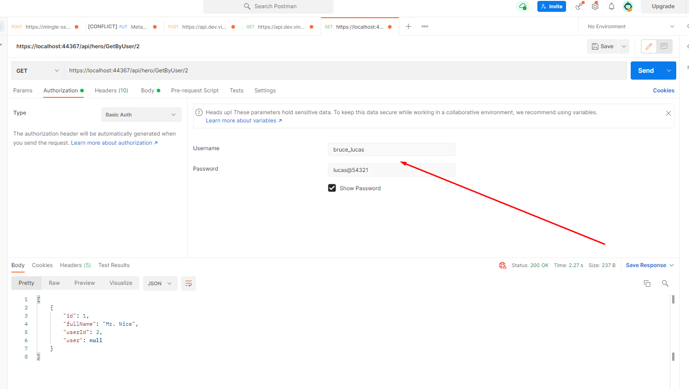

## Exposing API's
In this lesson we will write different API's for the methods defined in the repository so it can be then accessible by outside world.

### Creating model classes:

It is good practice to create models and use them between Client and API, instead of using the actual entities directly.

Right click API Project and add a new folder called `Models` with below classes:

`HeroMode.cs`

```C#
namespace TourOfHeroes.Models
{
    public class HeroModel
    {
        public string FullName { get; set; }
        public int? UserId { get; set; }
    }
}
```

`UserModel.cs`
```C#
namespace TourOfHeroes.Models
{
    public class UserModel
    {
        public string UserName { get; set; }
        public string Passsword { get; set; }
    }
}
```

`LoginModel.cs`
```C#
namespace TourOfHeroes.Models
{
    public class LoginModel
    {
        public string UserName { get; set; }
        public string Password { get; set; }
    }
}
```

Create a new API controller called `UserController` in the `Controllers` folder

`UserController.cs`

```C#
using System.Threading.Tasks;
using Microsoft.AspNetCore.Mvc;
using TourOfHeroes.DataAccess;
using TourOfHeroes.DataAccess.Entities;
using TourOfHeroes.Models;

namespace TourOfHeroes.Controllers
{
    [Route("api/[controller]")]
    [ApiController]
    public class UserController : ControllerBase
    {
        private readonly UserRepository userRepository;
        public UserController()
        {
            this.userRepository = new UserRepository();
        }

        [HttpPost("Create")]
        public async Task<IActionResult> Create (UserModel user)
        {
            await userRepository.Create(new User
            {
                UserName = user.UserName,
                Passsword = user.Passsword
            });
            return Ok();
        }

        [HttpPost("Login")]
        public IActionResult Login(LoginModel loginModel)
        {
            var user = userRepository.GetByCredentials(loginModel.UserName, loginModel.Password);
            if (user == null)
            {
                return NotFound();
            }
            return Ok(user);
        }
    }
}
```

Create another controller called `HeroController` in the `Controllers` folder.

`HeroController.cs`
```C#
using System.Threading.Tasks;
using Microsoft.AspNetCore.Mvc;
using TourOfHeroes.DataAccess;
using TourOfHeroes.DataAccess.Entities;
using TourOfHeroes.Models;

namespace TourOfHeroes.Controllers
{
    [Route("api/[controller]")]
    [ApiController]
    public class HeroController : ControllerBase
    {
        private readonly HeroesRepository heroesRepository;
        public HeroController()
        {
            heroesRepository = new HeroesRepository();
        }

        [HttpGet("Create")]
        public async Task<IActionResult> Create(HeroModel hero)
        {
            await heroesRepository.Create(new Hero
            {
                FullName = hero.FullName,
                UserId = hero.UserId
            });
            return Ok();
        }

        [HttpPut("Update")]
        public async Task<IActionResult> Update(HeroModel hero)
        {
            await heroesRepository.Update(new Hero
            {
                FullName = hero.FullName
            });
            return Ok();
        }

        [HttpGet("GetByUser/{userId}")]
        public IActionResult GetByUser(int userId)
        {
            var heroes = heroesRepository.GetByUser(userId);
            return Ok(heroes);
        }

        [HttpGet("GetById/{heroId}")]
        public async Task<IActionResult> GetById(int heroId)
        {
            var heroes = await heroesRepository.GetById(heroId);
            return Ok(heroes);
        }

        [HttpDelete]
        public async Task<IActionResult> Delete(int heroId)
        {
            await heroesRepository.Delete(heroId);
            return Ok();
        }
    }
}
```

Now that we have created all necessary API's for our Client Application to use.

Run the application and test some endpoint using Postman:

1. Create new user:

    Url: https://localhost:44367/api/user/create

    Method: POST

    Body
    ```json
    {
        "UserName": "bruce_lucas",
        "Passsword": "lucas@54321"
    }
    ```

    Should receive 200 OK response from server

2. Create new Hero:

    Url: https://localhost:44367/api/hero/create

    Method: POST

    Body
    ```json
    {
        "FullName": "Mr. Nice",
        "UserId": 2 // <-- to the user got created previously
    }
    ```

    Should receive 200 OK response from server

3. Login

    Url: https://localhost:44367/api/User/Login

    Method: POST

    Body
    ```json
    {
        "UserName": "bruce_lucas",
        "Password": "lucas@54321"
    }
    ```

    Should receive the response:
    ```json
    {
        "userId": 2,
        "userName": "bruce_lucas",
        "passsword": "lucas@54321"
    }
    ```

4. Get heroes by user

    Url: https://localhost:44367/api/hero/GetByUser/2

    Method: GET

    Should receive the response:

    ```json
    [
        {
            "id": 1,
            "fullName": "Mr. Nice",
            "userId": 2,
            "user": null
        }
    ]
    ```

<br>

## Adding Authentication

Right now the API's that we defined are open to public and anyone can access the API's / Database without even authentication. It is better to implement authentication system for the API's so they are secured.

Since we already have Login API exposed we can use it for the Login page in the future, but we need to verify every request if it is authorized to be served.

### Basic authentication:

There are different advanced authentication system available today, basic auth is the simplest authentication system where the HTTP request must pass `Authorization` header with base64 encoded `username:password` values.

Implementing the same in our solution:

Add a new class called `BasicAuthenticationHandler.cs`:

```C#
using System;
using System.Net.Http.Headers;
using System.Security.Claims;
using System.Text;
using System.Text.Encodings.Web;
using System.Threading.Tasks;
using Microsoft.AspNetCore.Authentication;
using Microsoft.Extensions.Logging;
using Microsoft.Extensions.Options;
using TourOfHeroes.DataAccess;

namespace TourOfHeroes
{
    public class BasicAuthenticationHandler : AuthenticationHandler<AuthenticationSchemeOptions>
    {
        private readonly UserRepository userRepository;

        public BasicAuthenticationHandler(
            IOptionsMonitor<AuthenticationSchemeOptions> options,
            ILoggerFactory logger,
            UrlEncoder encoder,
            ISystemClock clock)
            : base(options, logger, encoder, clock)
        {
            this.userRepository = new UserRepository();
        }

        protected override async Task<AuthenticateResult> HandleAuthenticateAsync()
        {
            if (!Request.Headers.ContainsKey("Authorization"))
                return AuthenticateResult.Fail("Missing Authorization Header");

            try
            {
                var authHeader = AuthenticationHeaderValue.Parse(Request.Headers["Authorization"]);
                var credentialBytes = Convert.FromBase64String(authHeader.Parameter);
                var credentials = Encoding.UTF8.GetString(credentialBytes).Split(new[] { ':' }, 2);
                var username = credentials[0];
                var password = credentials[1];

                var user = this.userRepository.GetByCredentials(username, password);
                if (user == null)
                {
                    return AuthenticateResult.Fail("Invalid Username or Password");
                }

                var claims = new[] {
                    new Claim(ClaimTypes.NameIdentifier, user.UserId.ToString()),
                    new Claim(ClaimTypes.Name, user.UserName),
                };
                var identity = new ClaimsIdentity(claims, Scheme.Name);
                var principal = new ClaimsPrincipal(identity);
                var ticket = new AuthenticationTicket(principal, Scheme.Name);

                return AuthenticateResult.Success(ticket);
            }
            catch
            {
                return AuthenticateResult.Fail("Invalid Authorization Header");
            }
        }
    }
}

```

This particular class verifies if the incoming request has valid auth header and verify if the provided credentials are found in the database. If not a failure response will be sent back to the client without even proceeding to any other action methods defined in the controller.

We need to register the same in the `Startup.cs` so this will be automatically invoked for every request.

The `ConfigureServices` should have the below lines:

```C#
public void ConfigureServices(IServiceCollection services)
{
    services.AddCors();
    services.AddControllers();

    // Add this
    services.AddAuthentication("BasicAuthentication").
            AddScheme<AuthenticationSchemeOptions, BasicAuthenticationHandler>("BasicAuthentication", null);
}
```

Also in `Configure` method:
```C#
public void Configure(IApplicationBuilder app, IWebHostEnvironment env)
{
    if (env.IsDevelopment())
    {
        app.UseDeveloperExceptionPage();
    }

    app.UseHttpsRedirection();

    app.UseRouting();

    // Add these two
    app.UseAuthentication();
    app.UseAuthorization();

    app.UseEndpoints(endpoints =>
    {
        endpoints.MapControllers();
    });
}
```

Also you need to enable the Authorization in required controllers so the authorization will be applied to those controllers. Example `UserController` may not required to be authorized because they are meant to `SignUp` and `Login` functionality which does not need `Àuthorization`, but the `HeroController` must be authorized.

Goto `HeroController.cs` and add `[Authorize]` attribute to the top

```C#
....
....
[Authorize] // Add this
[Route("api/[controller]")]
[ApiController]
public class HeroController : ControllerBase
{
    private readonly HeroesRepos
....
....
....
```

Now in Postman if you invoke any of the actions defined in `HeroController` you should get a response `403 Unauthorized`.

You can goto `Authorization` tab, select Basic Auth from the dropdown and provide username and password that you registerd a user with first time, and now if you send the request you should get a valid resposne with the data.



## :white_check_mark: Tasks
:white_check_mark: Create different methods in `ToyStore.DataAccess` project to interact with `Toys` and `User` table.

:white_check_mark: Create `ToysController` and `UserController`.

:white_check_mark: Write necessary API's to perform CRUD on `Toys` and `User` which internally invokes the methods defined in Data access.

:white_check_mark: Implement Authentication system for `ToysController`.

:white_check_mark: Verify all APIs are working as expected via Postman.