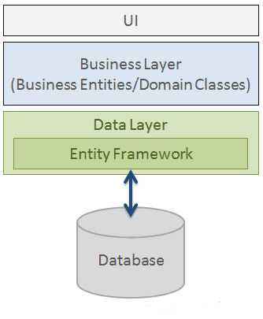

# Tour of Heroes - Tutorial

As part of this Course we are going to build a Web API from scratch with Database support as well.

The API will be designed for the following application called Tour of Heroes: https://angular-tour-of-heroes-example.stackblitz.io/


## Database design

As the first step we need to create a new database and define required tables.

1. Create new Database in SQL Server called `TourOfHeroes` and define two tables, Users to save user login credentials and Heroes to save list of Heroes defined by users.

The SQL Script to create the tables:

```SQL
CREATE TABLE [dbo].[Heroes](
	[Id] [int] IDENTITY(1,1) NOT NULL,
	[FullName] [nvarchar](100) NOT NULL,
	[UserId] [int] NULL,
 CONSTRAINT [PK_Heroes] PRIMARY KEY CLUSTERED 
(
	[Id] ASC
)
GO

SET ANSI_NULLS ON
GO
SET QUOTED_IDENTIFIER ON
GO

CREATE TABLE [dbo].[Users](
	[UserId] [int] IDENTITY(1,1) NOT NULL,
	[UserName] [nvarchar](100) NULL,
	[Passsword] [nvarchar](100) NULL,
 CONSTRAINT [PK_Users] PRIMARY KEY CLUSTERED 
(
	[UserId] ASC
)
GO

ALTER TABLE [dbo].[Heroes]  WITH CHECK ADD  CONSTRAINT [FK_Heroes_Users] FOREIGN KEY([UserId])
REFERENCES [dbo].[Users] ([UserId])
GO

ALTER TABLE [dbo].[Heroes] CHECK CONSTRAINT [FK_Heroes_Users]
GO
```

2. Create new Web API project with the all the steps explained in the previous session, name the project as `TourOfHeroes`.

3. Add a new **Class Library** project to the solution to segregate all database related operations, so we can define few classes and methods which does the operation and keep the Web API project simple and minimal. Right click Solution -> Add new item -> Select Class Library **(.NET CORE)**, provide a name `TourOfHeroes.DataAccess`.

### Talking to the Database

There are several ways to enable your application connect to the Database system and perform transactions, .NET provides a very developer friendly framework which helps to query, interact or operate on the database with methodology of manipulating an `object` or `collection of objects` rather than writing complex SQL commands. And that framwork is called as `Entity Framework`.

<br>

## Entity Framework:

Prior to .NET 3.5, we often used to write ADO.NET code or Enterprise Data Access Block to save or retrieve application data from the underlying database. We used to open a connection to the database, create a DataSet to fetch or submit the data to the database, convert data from the DataSet to .NET objects or vice-versa to apply business rules. This was a cumbersome and error prone process. Microsoft has provided a framework called "Entity Framework" to automate all these database related activities for your application.

Entity Framework is an open-source ORM framework for .NET applications supported by Microsoft. 

It enables developers to work with data using objects of domain specific classes without focusing on the underlying database tables and columns where this data is stored. 

With the Entity Framework, developers can work at a higher level of abstraction when they deal with data, and can create and maintain data-oriented applications with less code compared with traditional applications.



Lets start configuring entity framework in our application.

Install the below nuget packages on the second project which is **TourOfHeroes.DataAccess** and setup entity framework:

```c#
Install-Package Microsoft.EntityFrameworkCore -Version 5.0.13
Install-Package Microsoft.EntityFrameworkCore.SqlServer -Version 5.0.13
Install-Package Microsoft.EntityFrameworkCore.SqlServer.Design -Version 1.1.6
Install-Package Microsoft.EntityFrameworkCore.Tools -Version 5.0.13
```

### Nuget packages

An essential tool for any modern development platform is a mechanism through which developers can create, share, and consume useful code. Often such code is bundled into "packages" that contain compiled code (as DLLs) along with other content needed in the projects that consume these packages.

For .NET (including .NET Core), the Microsoft-supported mechanism for sharing code is NuGet, which defines how packages for .NET are created, hosted, and consumed, and provides the tools for each of those roles.

Put simply, a NuGet package is a single ZIP file with the .nupkg extension that contains compiled code (DLLs), other files related to that code, and a descriptive manifest that includes information like the package's version number. Developers with code to share create packages and publish them to a public or private host. Package consumers obtain those packages from suitable hosts, add them to their projects, and then call a package's functionality in their project code. NuGet itself then handles all of the intermediate details.


Once the installation is done, we have to generate the entities and context class from the Database. Follow the below stepes to do the same:

1. Goto Tools -> Nuget Package Manager -> Package Manager Console, you will see a console window where you can type different commands.

2. Right click `TourOfHeroes.DataAccess` project, add new folder called `Entities`.

2. In the console, type the below command:

    ```nuget
    Scaffold-DbContext "Server=localhost;Database=TourOfHeroes;Trusted_Connection=True;" Microsoft.EntityFrameworkCore.SqlServer -OutputDir Entities
    ```

    The above command helps to connect to the database and generate the equivalent C# classes which are called as `Entities` and also `Context` class which is responsible to handle all DB transactions.


**Connection strings**: As you can see the above scaffold command uses connection string "Server=localhost;Database=TourOfHeroes;Trusted_Connection=True;". The connetion string is an identification of a particular Database which relies on specific server, it has different segments in it like Server=localhost so the address of the server can be provided, Database=TourOfHeroes is to identify what database it is supposed to connect. The connetion string has many different segments including authentication system as well. 

You can see the `Context` class also points to the same connection string, because it is required in the later stages for the class to know the target database it is supposed to communicate.

## :white_check_mark: Tasks

:white_check_mark: Create a table called `User` with columns: `Id (int)(identity)(pk)`, `Name (nvarchar(30))`, `UserName(nvarchar(100))`, `Password(nvarchar(100))` in `ToyStore` database.

:white_check_mark: Create new ASP.NET Core Web API project called `ToyStore`

:white_check_mark: Create new Data access layer (Class Library) called `ToyStore.DataAccess`

:white_check_mark: Configure `Entity Framework` and use scaffold command to generate the entities from the `ToyStore` database created in the previous sessions.

<br>

## Defining Data access methods

We can now start defining different methods to perform DB operations in `TourOfHeroes.DataAccess` project.

1. Right click `TourOfHeroes.DataAccess` project and add new class called `UserRepository.cs`

```C#
using System.Threading.Tasks;
using TourOfHeroes.DataAccess.Entities;
using System.Linq;

namespace TourOfHeroes.DataAccess
{
    public class UserRepository
    {
        private readonly TourOfHeroesContext dbContext;
        public UserRepository()
        {
            this.dbContext = new TourOfHeroesContext();
        }

        public async Task Create(User user)
        {
            await dbContext.Users.AddAsync(user);
            await this.dbContext.SaveChangesAsync();
        }

        public User GetByCredentials (string userName, string password)
        {
            var user = dbContext.Users.Where(usr => usr.UserName == userName && usr.Passsword == password).FirstOrDefault();
            return user;
        }
    }
}

```

2. Right click `TourOfHeroes.DataAccess` project and add new class called `HeroesRepository.cs`

```C#
using System.Collections.Generic;
using System.Threading.Tasks;
using TourOfHeroes.DataAccess.Entities;
using System.Linq;
namespace TourOfHeroes.DataAccess
{
    public class HeroesRepository
    {
        private readonly TourOfHeroesContext dbContext;
        public HeroesRepository()
        {
            this.dbContext = new TourOfHeroesContext();
        }

        public async Task Create(Hero hero)
        {
            dbContext.Heroes.Add(hero);
            await dbContext.SaveChangesAsync();
        }

        public async Task Update (Hero hero)
        {
            var existingHero = dbContext.Heroes.Where(h => h.Id == hero.Id).FirstOrDefault();
            if (existingHero != null)
            {
                existingHero.FullName = hero.FullName; // update only changeable properties
                await this.dbContext.SaveChangesAsync();
            }
        }

        public List<Hero> GetByUser (int userId)
        {
            return dbContext.Heroes.Where(h => h.UserId == userId).ToList();
        }

        public async Task<Hero> GetById (int heroId)
        {
            var hero = await dbContext.Heroes.FindAsync(heroId);
            return hero;
        }

        public async Task Delete (int heroId)
        {
            var hero = await GetById(heroId);
            if (hero != null)
            {
                dbContext.Heroes.Remove(hero);
            }
        }
    }
}
```

### [NEXT - Exposing API's](./api.md)